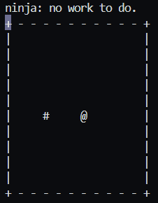

# ASCII-Snake

An ASCII implementation of Snake within C. All within your very own console!
This project uses `<windows.h>`, so it is only compatible with Windows OS.



## How it works

A simple while loop with a `sleep` statment at the end of the logic moves the screen,
while ANSII escape codes handle "refreshing" the screen.

The program uses the Windows function `GetAsyncKeyState` to get keypresses that occured while the program was still refreshing.

## Running the program

Make sure you have `ninja`, `cmake`, and a `C compiler`.

Then run these commands:

``` txt
make reset
make run
```

ASCII-Snake uses classic `WASD` controls.
